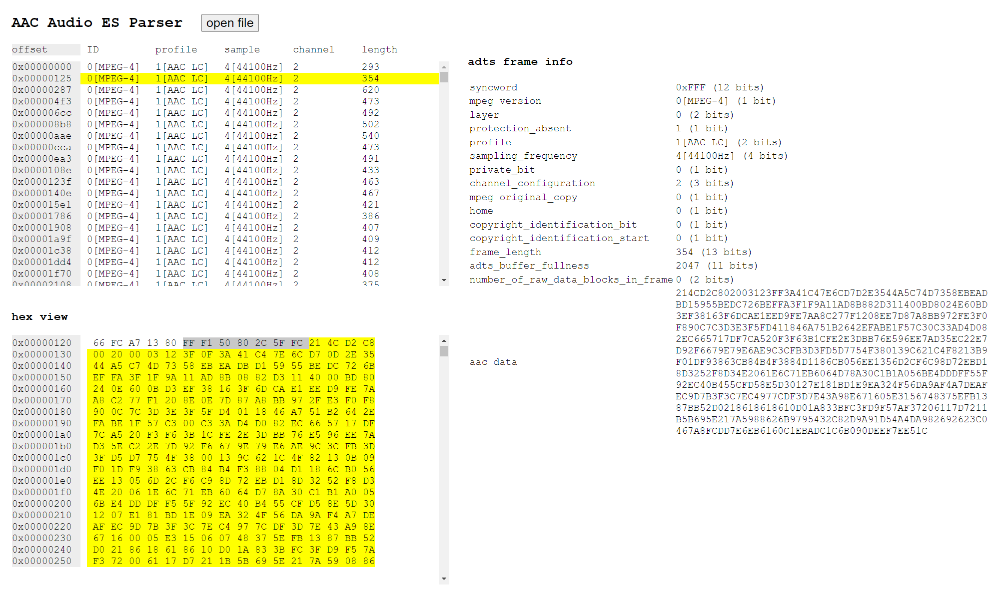

# online aac audio es parser

[demo](https://baiyufei.github.io/online-aac-audio-es-parser/)




## Project setup
```
npm install
```

### Compiles and hot-reloads for development
```
npm run serve
```

### Compiles and minifies for production
```
npm run build
```

### Lints and fixes files
```
npm run lint
```